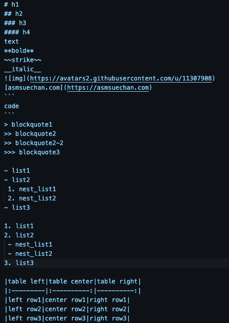
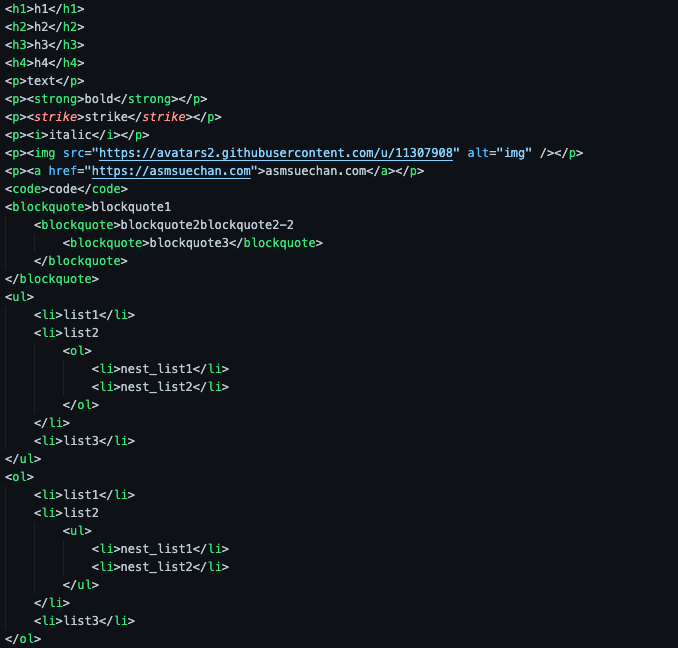
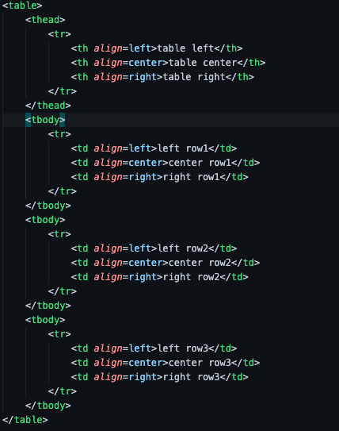

# myMarkdown

# 概要
- 自作のマークダウン
- strong, i, strike, ul, ol, h1~h4, blockquote, img, a, code, table, pに対応

- 以下のようなマークダウンを入力すると

- このような入力の時に以下のような出力を得られます(改行は手動で行っています)

# 使い方
- index.pyのconvertToHTMLString()という関数を呼び出して、変換したいマークダウンを渡します。
- 返り値としてhtmlに変換されたものが返ってきます。

# 今後
- brの追加

# 参考サイト
- マークダウンパーサを作ろう
https://www.m3tech.blog/entry/2021/08/23/124000
- こちらのリポジトリも参考にしています
https://github.com/asmsuechan/minute