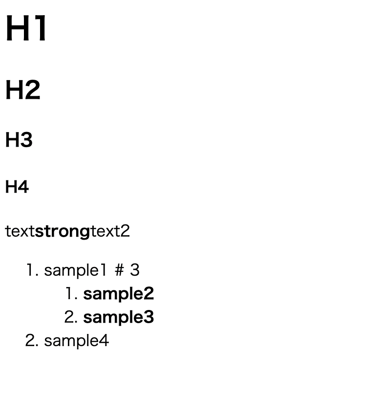

# myMarkdown

# 概要
- 自作のマークダウン
- strong, i, strike, ul, ol, h1~h4, blockquoteに対応
```bash
# **H1**
## H2
### H3
#### H4
text**strong**text2
1. sample1 # 3
    1. **sample2**
    2. **sample3**
2. sample4
```
このような入力の時に以下のような出力を得られます


# 使い方
- index.pyのconvertToHTMLString()という関数を呼び出して、変換したいマークダウンを渡します。
- 返り値としてhtmlに変換されたものが返ってきます。

# 今後
- block, code, tableの実装
- 変換したhtmlをいい感じに改行して読みやすくなるようにする
# 参考サイト
- マークダウンパーサを作ろう
https://www.m3tech.blog/entry/2021/08/23/124000